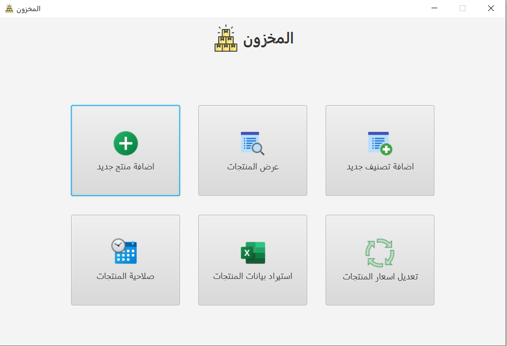
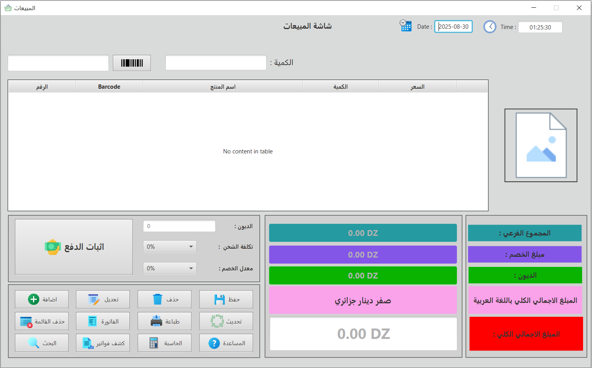
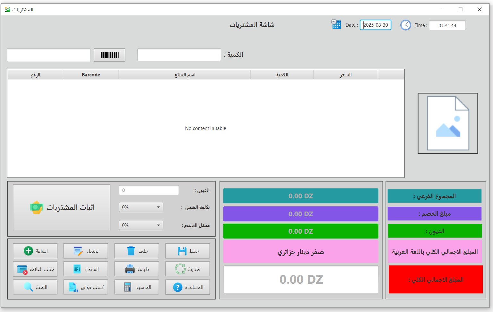
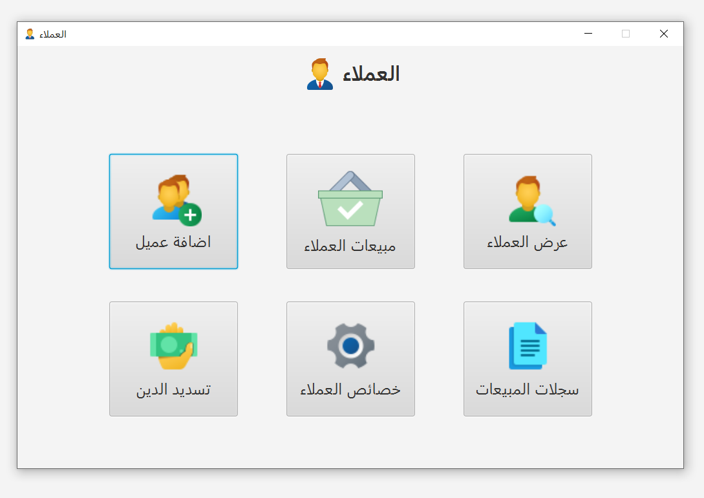

# SKK - POS System

## 📌 Project Overview
**SKK** is a Point of Sale (POS) system built using **Java (JavaFX)** with **MySQL** integration.  
It is designed to manage sales, purchases, inventory, clients, and records in a structured and efficient way.

This project follows the **MVC architecture** with separate packages for controllers, models, and utilities.

---

## 🚀 Features
- 📦 **Inventory Management** (Products, Units, Categories, Expiration Tracking)
- 🛒 **Sales Management** (Cart, Sales Items, Sales Records)
- 📑 **Purchases Tracking** (Supplier purchases & history)
- 👤 **Client Management** (Client details, debts, payments)
- 💳 **Debt & Payment Handling**
- 🖨 **Barcode Scanning Support**
- 🖼 **Image Upload for Products**
- 📊 **Reports & Inquiries**
- 🔐 **Database Connection Utility**

---

## 🏗️ Project Structure

```bash
src/main/java/com/example/library
│
├── Alert/ # Custom alert dialogs
├── controller/ # Controllers for UI logic
│ ├── barcode/
│ ├── client/
│ ├── home/
│ ├── inquiries/
│ ├── inventory/
│ ├── ProductGateWay/
│ ├── Purchases/
│ ├── Records/
│ └── sales/
│
├── model/ # Data models (POJOs & DAOs)
│ ├── Client, Product, Sale, Purchase ...
│ └── DatabaseConnection (utility class)
│
└── util/ # Utility helpers
```
---

## ⚙️ Technologies Used
- **Java 21**
- **JavaFX** (UI Framework)
- **MySQL** (Database)
- **Maven** (Dependency Management & Build Tool)
- **ZXing** (Barcode Scanning)
- **Apache POI** (Excel file handling)
- **USB4Java** (USB device support)

---

## 📂 Database
The project uses **MySQL** with schema `skk`.

Tables include (example):
- `products`
- `unit`
- `category`
- `product_status`
- `client`
- `sales`
- `purchases`
- `debt`, `debt_payment`
- `records`

---

## ▶️ How to Run
1. Clone the repository:
   ```bash
   git clone https://github.com/Damim-03/SKK.git
   cd SKK

##
2. Configure the database:
   ```bash
   private static final String URL = "jdbc:mysql://localhost:3306/skk";
   private static final String USER = "root";
   private static final String PASSWORD = "your_password";
##
3. Build & Run using Maven
   ```bash
   mvn clean install
   mvn javafx:run
##
4. Or run directly from IntelliJ IDEA.


## 📸 Screenshots


### 🏠 Home Dashboard


### 📦 Inventory Management


### 🛒 Sales Screen
 

### 📑 Purchases Screen


### 👤 Client Management



## 👨‍💻 Author

Damim_X_Adi 👍👍👍 https://github.com/Damim-03

---

## 📜 License
This project is licensed under the [MIT License](LICENSE).

© 2025 Imadeddine Kir. All rights reserved.

