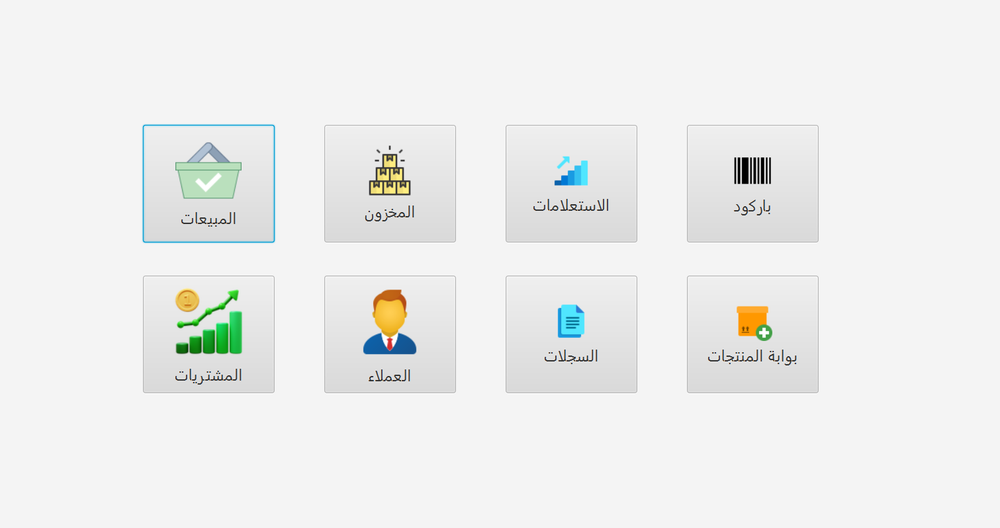

# SKK - POS System

## 📌 Project Overview
**SKK** is a Point of Sale (POS) system built using **Java (JavaFX)** with **MySQL** integration.  
It is designed to manage sales, purchases, inventory, clients, and records in a structured and efficient way.

This project follows the **MVC architecture** with separate packages for controllers, models, and utilities.

---

## 🚀 Features
- 📦 **Inventory Management** (Products, Units, Categories, Expiration Tracking)
- 🛒 **Sales Management** (Cart, Sales Items, Sales Records)
- 📑 **Purchases Tracking** (Supplier purchases & history)
- 👤 **Client Management** (Client details, debts, payments)
- 💳 **Debt & Payment Handling**
- 🖨 **Barcode Scanning Support**
- 🖼 **Image Upload for Products**
- 📊 **Reports & Inquiries**
- 🔐 **Database Connection Utility**

---

## 🏗️ Project Structure

```bash
src/main/java/com/example/library
│
├── Alert/ # Custom alert dialogs
├── controller/ # Controllers for UI logic
│ ├── barcode/
│ ├── client/
│ ├── home/
│ ├── inquiries/
│ ├── inventory/
│ ├── ProductGateWay/
│ ├── Purchases/
│ ├── Records/
│ └── sales/
│
├── model/ # Data models (POJOs & DAOs)
│ ├── Client, Product, Sale, Purchase ...
│ └── DatabaseConnection (utility class)
│
└── util/ # Utility helpers
```
---

## ⚙️ Technologies Used
- **Java 21**
- **JavaFX** (UI Framework)
- **MySQL** (Database)
- **Maven** (Dependency Management & Build Tool)
- **ZXing** (Barcode Scanning)
- **Apache POI** (Excel file handling)
- **USB4Java** (USB device support)

---

## 📂 Database
The project uses **MySQL** with schema `skk`.

Tables include (example):
- `products`
- `unit`
- `category`
- `product_status`
- `client`
- `sales`
- `purchases`
- `debt`, `debt_payment`
- `records`

---

## ▶️ How to Run
1. Clone the repository:
   ```bash
   git clone https://github.com/Damim-03/SKK.git
   cd SKK

##
2. Configure the database:
   ```bash
   private static final String URL = "jdbc:mysql://localhost:3306/skk";
   private static final String USER = "root";
   private static final String PASSWORD = "your_password";
##
3. Build & Run using Maven
   ```bash
   mvn clean install
   mvn javafx:run
##
4. Or run directly from IntelliJ IDEA.


## 📸 Screenshots


### 🏠 Home Dashboard


### 📦 Inventory Management


### 🛒 Sales Screen
 

### 📑 Purchases Screen


### 👤 Client Management


## 👨‍💻 Author

Damim_X_Adi 👍👍👍 https://github.com/Damim-03

---

## 📜 License

MIT License

Copyright (c) 2025 Imadeddine Kir --- X --- Damim_X_Adi

Permission is hereby granted, free of charge, to any person obtaining a copy
of this software and associated documentation files (the "Software"), to deal
in the Software without restriction, including without limitation the rights
to use, copy, modify, merge, publish, distribute, sublicense, and/or sell
copies of the Software, and to permit persons to whom the Software is
furnished to do so, subject to the following conditions:

The above copyright notice and this permission notice shall be included in all
copies or substantial portions of the Software.

THE SOFTWARE IS PROVIDED "AS IS", WITHOUT WARRANTY OF ANY KIND, EXPRESS OR
IMPLIED, INCLUDING BUT NOT LIMITED TO THE WARRANTIES OF MERCHANTABILITY,
FITNESS FOR A PARTICULAR PURPOSE AND NONINFRINGEMENT. IN NO EVENT SHALL THE
AUTHORS OR COPYRIGHT HOLDERS BE LIABLE FOR ANY CLAIM, DAMAGES OR OTHER
LIABILITY, WHETHER IN AN ACTION OF CONTRACT, TORT OR OTHERWISE, ARISING FROM,
OUT OF OR IN CONNECTION WITH THE SOFTWARE OR THE USE OR OTHER DEALINGS IN THE
SOFTWARE.

Be careful 😊😊😊

© 2025 Imadeddine Kir. All rights reserved.

